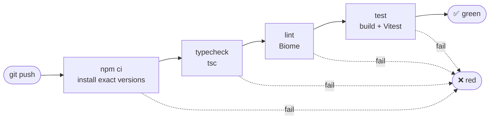

# Quests

## The pipeline

Every push runs `.github/workflows/ci.yaml`. The first failing step stops the run.



Run the same steps locally with `npm run ci`.

## Key things the workflow can catch

For each quest, make the break, commit, push, and check which step goes red in the Actions tab. Then fix it and push again to go green. The local command shows the same failure before you push.

### 1. "Works on my machine"
Create `src/greet.ts`, import it in `src/main.ts`, then commit only `main.ts`. It passes locally but goes red on GitHub at **typecheck**, because CI only sees committed files.

1. Create `src/greet.ts`:
   ```ts
   export function greet(): string {
     return "Hello!";
   }
   ```
2. In `src/main.ts`, add `import { greet } from "./greet.js";` under the first import, and `console.log(greet());` at the end.
3. Run `npm run ci`. It passes, because `greet.ts` is on your disk.
4. Commit and push only `main.ts` (start from a clean, already-pushed project):
   ```bash
   git add src/main.ts
   git status --short   # expect: M  src/main.ts  and  ?? src/greet.ts
   git commit -m "Use greet in main"
   git push
   ```
5. On GitHub, **typecheck** goes red: `Cannot find module './greet.js'`.
6. Fix it by committing the missing file:
   ```bash
   git add src/greet.ts
   git commit -m "Add greet.ts"
   git push
   ```

### 2. CI stops at the first failure
In `src/fizzbuzz.ts`, change `n % 3 === 0` to `n % 3 == 0` and `n % 15` to `n % 14`. Goes red at **lint**, and the broken tests never run. Local: `npm run ci`.

### 3. The folder default breaks
Servers show a folder's `index.html` when you ask for the folder, which is why `/src/` works without typing the file name. In `scripts/serve.mjs`, change `const INDEX = "index.html"` to `"home.html"`. Goes red at **test** ("serves a folder's index.html"): `/src/` now returns 404 because the server looks for a file that doesn't exist. Many servers would show a file list ("Index of /") here instead. This one deliberately returns 404, so it never exposes your folders. Local: `npm test`.

### 4. A page goes missing
Two ways, each showing a different side of 404:
- **The page isn't there:** rename `src/index.html` to `src/index.htm` (a typo, or a file that never got committed). Typecheck and lint still pass, because no code is wrong. Goes red at **test**: "serves the page" and "serves a folder's index.html" get 404 instead of 200, and the terminal tests can't load the page at all (`ENOENT`). In a browser, the front door lands on "Page not found".
- **The server hides it:** in `scripts/serve.mjs`, change `res.writeHead(404` to `res.writeHead(200`. A missing page now says "OK", so browsers, search engines and checks treat a broken link as a working one (a "soft 404"). Goes red at **test** ("returns a 404 status for an unknown path").

Local: `npm test`.

### 5. Type error
In `src/fizzbuzz.ts`, change `return String(n);` to `return n;`. Goes red at **typecheck**. Local: `npm run typecheck`.

### 6. Wrong maths
In `src/fizzbuzz.ts`, change `n % 15` to `n % 14`. Goes red at **test** on 15, 30 and 45. Local: `npm test`.

### 7. 0 doesn't quit
In `src/main.ts`, change `n === 0` to `n === -1`. Goes red at **test** ("0 quits"). Local: `npm test`.

### 8. Run button doesn't restart
In `src/main.ts`, delete `runButton.addEventListener("click", start);`. Goes red at **test** ("Run restarts"). Local: `npm test`.

### 9. Bad-input message changed
In `src/main.ts`, change `"Please enter a whole number."` to `"Nope."`. Goes red at **test** ("rejects bad input and keeps going"): expected `"Please enter a whole number."`, received `"Nope."`. Nothing is broken for the user, only the wording changed. The test checks the exact text, so it shows how a test can be too strict. Local: `npm test`.

### 10. Errors on page load
- **Add an error:** put `console.error("oops");` at the end of `src/main.ts`. Goes red at **test** ("loads without errors").
- **Break existing code:** in `src/index.html`, change `id="run"` to `id="runn"`. `main.ts` can't find the button and crashes on load, so all 7 terminal tests go red with `Missing element #run`. In a browser, the page looks fine but doesn't respond to input.

Local: `npm test`.
